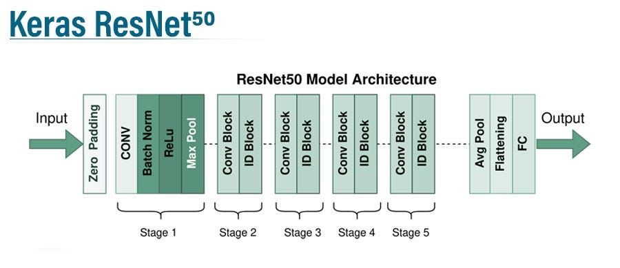

# 3D Handpose Estimation using Single Depth Images (CSC490H5F)
**Group**: Gesture Geniuses

**Group Members**: Taha Kazi, Saad Afridi, Daria Illarionova, Carlos Saputra

## Setup

### Download the Dataset and Model Weights
Download the ICVL Dataset [here](https://labicvl.github.io/hand.html) and our pre-trained model weights [here](https://drive.google.com/file/d/1IxQhVsetIYin2Soj3mgF3EGy1yPOrlFm/view?usp=drive_link) 


### File Explanations and Usage
Each file corresponds with the stage of the model:
`CSC490_saad_preprocessing_and_training.ipynb` 
As the name highlights this is the file depicting the preprocessing and training of the model. Here is all the explanatory work occurring on the dataset and model training on a subset (~5000 images).

`CSC490_carlos_tuning.ipynb`, in this file you will find the source of our validation code and the source of our pre-trained weights. 

`CSC490_daria_evaluation.ipynb`, in this file you will find our evaluation code. Here we use a subset of the ICVL dataset to evaluate our model performance. 


## Problem Statement

Estimation of 3D hand pose from single depth images is a pressing challenge in computer vision. Existing methods face limitations in precision and robustness, particularly in handling joint ambiguities, and complex hand poses. This project aims to utilize Machine Learning to improve the accuracy and reliability of 3D hand pose estimation, enhancing its applicability in virtual reality, gesture recognition, and human-computer interaction systems.

 ## Dataset
 Our dataset can be found [here](https://labicvl.github.io/hand.html). We are working with the ICVL dataset in our project. The dataset is 2GB in size – not as large as our previous chosen dataset, which is good for efficiency in processing and training. It contains a total of 330,000 depth images with a 240 x 320 resolution for each image. All images are labelled with target coordinates for the 16 joints (48 points in total accounting for 3-D (x,y,z)). The order of the 16 joints is Palm, Thumb root, Thumb mid, Thumb tip, Index root, Index mid, Index tip, Middle root, Middle mid, Middle tip, Ring root, Ring mid, Ring tip, Pinky root, Pinky mid, Pinky tip. [1] 

 An image labelling each of the hand joints that are tracked [2]:
 


A sample of hand images is available below, to get a visual sense of the ICVL dataset we used [3]:


## Implementation Overview

### Processing the Dataset (Novel/Exciting!)

In the ICVL dataset, we have depth images, where each pixel represents a distance (in millimeters). So, values can range from anywhere between 0 to 32,000. A pixel value of 32,000 indicates that nothing was detected by the sensor. This creates some complexity when processing the images. The standard way to normalize images i.e., $\frac{x-\mu}{\sigma}$ is no longer sufficient since the mean is so skewed by the 32,000s'.

Hence, since the 32,000 indicates no detection, in other words, no information we set all instances of 32,000 to 0 and divide the rest of the pixel by the second largest pixel value. Here's an example, where 800 is the second greatest pixel value. 

$$
\begin{bmatrix} 
    32000 & 800 & \dots \\
    \vdots & \ddots & \vdots \\
     32000 &  \dots & 200
    \end{bmatrix}
\rightarrow
 \begin{bmatrix} 
    0 & 1 & \dots \\
    \vdots & \ddots & \vdots \\
     0 &  \dots & 0.25 \\ 
    \end{bmatrix}
$$

**NOTE**: Since the images are not expected to follow a normal distribution and there could be great outliers, we do not use the standard normalization after just setting the 32,000 to 0's.

### Model

#### Architecture 



Our model architecture is Keras ResNet50 + Flatten Layer + Dropout Layer + Linear Layer. Here is our code for the model:

```
from tensorflow.keras.applications.resnet50 import ResNet50

base_model = ResNet50(include_top=False,
                      weights=None,
                      input_shape=(IMG_HEIGHT, IMG_WIDTH, 1))
                      
# Flatten output layer of Resnet + Add your own layers for regression
x = tf.keras.layers.Flatten()(base_model.output)
x = tf.keras.layers.Dense(256,
                          activation='relu')(x)
x = tf.keras.layers.Dropout(0.5)(x)
output_layer = tf.keras.layers.Dense(48,
                                     activation='linear',
                                     name="DenseOutput")(x)
# Initialize Model
model = tf.keras.models.Model(inputs=base_model.input, outputs=output_layer)
```

#### Transfer Learning 

One big decision our group had to make was choosing to use the pre-trained weights of ResNet50 or not. We chose not to because

1. ResNet50 was trained on an image classification task, on the ImageNet dataset, which would not transfer well to our problem/dataset. Since our dataset is comprised of *masked* hand images and is a regression problem i.e., predicting the coordinates of the joints in the 3D space. 
2. ResNet50 pre-trained weights top-layer expects a specific dimenions of input (2D RGB images) whereas our dataset consists of single depth images, so there would be complications in terms of implementation.

Hence, we chose to not proceed with transfer learning.

#### Input and Output
Our model takes a numpy array representation of a single depth image. An example of a single depth image 


The numpy array is of data type float32 where the values range anywhere from 0-1 and has dimensions (240, 320, 1). While the output are 48 coordinate predictions in (x,y,z) format for each joint.

Defined mathematically:

$$\begin{bmatrix} 
    x_{11} & x_{12} & \dots \\
    \vdots & \ddots & \vdots \\
     x_{m1} &  \dots & x_{mn} \\ 
    \end{bmatrix}$$

Where $m=240$, and $n=320$ and $0 \le x_i \le 1$ for all $i$.

The model outputs an array of 48 floats (as defined in the linear layer of the model). Defined mathematically:

$$\begin{bmatrix} 
    x_1 & \dots &  x_n
    \end{bmatrix}$$

Where $n=48$ and $x_i$ is one of $x,y,z$ point in the 3D space for all $i$. 


#### Tuning the Model
 
After Training, we need to train the hyperparameters and we found that there are 2 hyperparameters that can be tuned (Learning Rate and Batch Size). However, after experimenting with larger learning rate, we found that it causes the gradient too fluctuate (due to the nature of coordinates being precise with floats). Hence,
we decide to only optimize the Batch Size. Choosing the Batch Size is also problematic since we are dealing with large dataset and images. Hence the maximum Batch Size that we can use depends on 

$$ max\_batch\_size = available\_GPU\_memory / 4 / (size\_of\_tensors + trainable\_parameters) $$

So, we decide to train only on 128 and 64 batch size. Optimizing with both batch size took approximately 2 days total with the available GPU. The results are shown below (in the Validation Error).
And also to avoid all data being preprocessed at the same time, we preprocess the data during training meaning that after we select a batch size, we preprocess them then train them instead of preprocessing all 330k images.

You can find our pretrained weights for both batch size [here](https://drive.google.com/file/d/1IxQhVsetIYin2Soj3mgF3EGy1yPOrlFm/view?usp=drive_link)


## Evaluation Results

In terms of our Evaluation results we looked at 3 major values, namely Mean Absolute Error value (MAE), Median Absolute Error value, and Standard Deviation of Residuals value:

1. **Mean Absolute Error (MAE) value**: 11.9, suggesting a moderate level of error in the predictions.
2. **Median Absolute Error value**: 9.9, suggesting that ¼ of the model predictions have an absolute error of less than 9.9 units.
3. **Standard Deviation of Residuals value**: 15.3, suggesting that there is a slight variability in the model’s predictions. Ultimately highlighting that certain handposes or scenarios yield more accurate predictions, while others may result in larger errors.

The Mean Absolute Error (MAE) value of 11.9 indicates the average absolute difference between the predicted and true 3D hand poses in our test dataset.
The higher the MAE, the larger the average magnitude of errors. In this case, a MAE of 11.9 suggests a slight level of error in the predictions.

The median absolute error yielded a value of 9.9.
The median absolute error is the median value of the absolute differences between predicted and true 3D hand poses.
A value of 9.9 implies that, on average, a quarter of our model's predictions have an absolute error of less than 9.9 units. 
Our median absolute error being on the lower end, indicate that the model's predictions are close to the true values and mostly consistent across instances.

The standard deviation measures the spread or variability of errors around the mean, where a higher standard deviation indicates a greater spread of errors. 
A standard deviation of approximately 15.3 suggests that there is slight variability in the model's predictions. 
This indicates that individual predictions are varying quite a bit from the average prediction error.  Some predictions may have errors much larger than the mean error, while others may have errors much smaller. 
Our standard deviation suggests that some poses or scenarios may lead to more accurate predictions, while others may result in larger errors.


Below are the results from the console:

<blockquote>
Evaluate the Test Dataset
<br/>84/84 [==============================] - 777s 9s/step - loss: 11.9997 - mae: 11.9997
<br/> test loss, test acc: [11.999682426452637, 11.999682426452637]
<br/> Finished Evaluating the Test Dataset
</blockquote>

and then the standard deviation

<blockquote>
Evaluate the Test Dataset for Standard Deviation
<br/>Median Absolute Error: 9.92608306884766
<br/>Standard Deviation of Residuals: 15.30694876771734
<br/>Finished Evaluating the Test Dataset
</blockquote>


Below is a scatter plot of predicted compared to the actual values. This visualization allows us to understand how well the model is performing in terms of estimating the 3D poses. The plot shows a diagonal line yet its shape indicates that the model's accuracy varies across different poses. 
Suggesting that the model might be struggling with certain intricate or less common hand configurations, leading to increased variability in the predictions. :


### Training and Validation Error

Below is a graph displaying the training and validation loss from different batch sizes:

1. Blue and Orange corresponds to training and validation loss of 128 batch size respectively (there is a cutoff due to crash during training, unable to retrieve graph information before checkpoint)
2. Green and Red corresponds to training and validation loss of 64 batch size respectively

(Training dataset has higher loss due to Dropout layers, not the case for Validation dataset)

 


## Problems we could not solve

### Webcam based real-time hand modelling

We ventured out to add an application layer to our project, however, it turned out  that the inference time for a single image is too long i.e.,  (~3 seconds) to implement webcam based real time hand modelling.

## Contributions:


| Name     | Contribution |
| ----------- | ----------- |
| Saad Afridi     | - Writing the training code <br/> - Writing the preprocessing code <br/> - Organizing all group members, checking progress and other managerial duties    |
| Carlos Saputra   | - Writing the validation code <br/> - Tuning training code to run across days (saving models, loading models etc.) <br/> - Assisted other members with their technical portion of the project  |
| Daria Illarionova | - Writing the testing and evaluation code <br/> - Leading development on **most** group related course assignments (posters, slides etc.) |
| Taha Kazi | - Assisted in writing the training code <br/> - Lead development on the README and repository documentation |


## References:

[1] Imperical College of London. (n.d.). 3D articulated hand pose estimation with single depth images. 3D Hand Pose Estimation. https://labicvl.github.io/hand.html 

[2] N. Otberdout, L. Ballihi and D. Aboutajdine, ”Hand pose estimation based on deep learning depth map for hand gesture recognition,” 2017 Intelligent Systems and Computer Vision (ISCV), Fez, Morocco, 2017, pp. 1-8, doi: 10.1109/ISACV.2017.8054904.

[3] Tang, D., Chang, H. J., Tejani, A., &amp; Kim, T.-K. (2017b). Latent regression forest: Structured estimation of 3D Hand poses. IEEE Transactions on Pattern Analysis and Machine Intelligence, 39(7), 1374–1387. https://doi.org/10.1109/tpami.2016.2599170 

